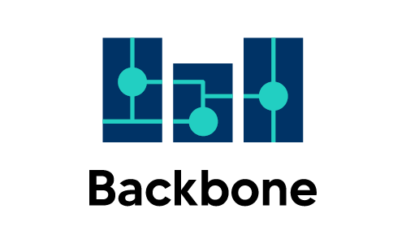
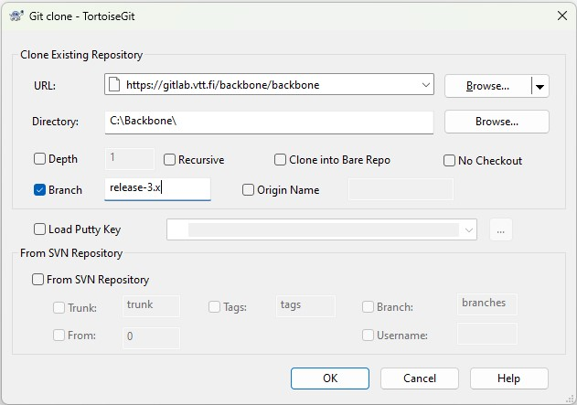

{width=40% height=40%}

# Backbone

Backbone is a generic energy network optimization tool written in [GAMS](https://www.gams.com/). Backbone can model a large range of energy system features, including but not limited to
* Generation, storages, transmission, and conversion between energy carriers,
* operation and investments,
* Energy, emissions, materials, and costs,
* forecasts and reserves,
* hydro power reservoirs, cascades, and delays,

Backbone has been designed to be highly adaptable in different dimensions: temporal, spatial, technology representation and market design. Backbone can support multiple different models due to the data driven model structure, modifiable temporal structure, and varying lengths of the time steps.

This flexibility has been used to model a wide range of applications
* Multi-sector studies: power, district heating, transport, buildings, and industry,
* Electricity distribution grids,
* Building thermodynamic properties and heating
* Multi-objective optimization
* Biomass supply model
* P2X and carbon economy
* LCA emissions

Our wiki page hosts a longer [list of publications](https://gitlab.vtt.fi/backbone/backbone/-/wikis/More-information/List-of-publications). In a recent [academic review](https://www.sciencedirect.com/science/article/pii/S2211467X2300086X), Backbone was identified to be one of the most technically advanced open source energy system models. However, the review was done with relatively old model version and the latest version has improved much since the publication of the article.

## Citation

If you use Backbone in a published work, please cite the following publication, which describes the Backbone energy systems modelling framework:

*MDPI and ACS Style*  
Helistö, N.; Kiviluoma, J.; Ikäheimo, J.; Rasku, T.; Rinne, E.; O’Dwyer, C.; Li, R.; Flynn, D. Backbone—An Adaptable Energy Systems Modelling Framework. Energies 2019, 12, 3388. https://doi.org/10.3390/en12173388

*AMA Style*  
Helistö N, Kiviluoma J, Ikäheimo J, Rasku T, Rinne E, O’Dwyer C, Li R, Flynn D. Backbone—An Adaptable Energy Systems Modelling Framework. Energies. 2019; 12(17):3388. https://doi.org/10.3390/en12173388

*Chicago/Turabian Style*  
Helistö, Niina, Juha Kiviluoma, Jussi Ikäheimo, Topi Rasku, Erkka Rinne, Ciara O’Dwyer, Ran Li, and Damian Flynn. 2019. "Backbone—An Adaptable Energy Systems Modelling Framework" Energies 12, no. 17: 3388. https://doi.org/10.3390/en12173388 

## Authors

* Juha Kiviluoma
* Erkka Rinne
* Topi Rasku
* Niina Helisto
* Dana Kirchem
* Ran Li
* Ciara O'Dwyer
* Jussi Ikäheimo
* Eric Harrison
* Tomi J. Lindroos

## Backbone license

This program is free software: you can redistribute it and/or modify it under the terms of the GNU Lesser General Public License as published by
the Free Software Foundation, either version 3 of the License, or (at your option) any later version.

This program is distributed in the hope that it will be useful, but WITHOUT ANY WARRANTY; without even the implied warranty of
MERCHANTABILITY or FITNESS FOR A PARTICULAR PURPOSE. See the GNU Lesser General Public License for more details.

You should have received a copy of the GNU Lesser General Public License when installing this program (COPYING, COPYING.LESSER files). If not, see <http://www.gnu.org/licenses/>.

## Installing Backbone

It is recommended to install a Git interface, such as [TortoiseGit](https://tortoisegit.org/) and use the git for version control and convenient way to update the model to new versions. Tortoise git requires a Git installation, but it gives instructions to follow during the installation process.

Extended installation instructions are at [Quick start guide](https://gitlab.vtt.fi/backbone/backbone/-/wikis/Getting-started/Quick%20Start).

**Installing with TortoiseGit**
* Open file browser and create a folder for Backbone, e.g. C:\Backbone
* Right click "Backbone" folder and select "clone" under the tortoise git selection pane
    * NOTE: the folder must be empty when cloning the model.
* copy "https://gitlab.vtt.fi/backbone/backbone" to URL
* double check that the installation folder is correct. Current version of tortoiseGit suggests c:\backbone\backbone, but you should remove the unnecessary subfolder
* write 'release-3.x' to branch

{width=40% height=40%}

* click and wait for the download to finish.

Gitlab should not require registration or access tokens before allowing the cloning, but these are required if you want to create your own branch or push updates. In such cases,
* you can register in https://gitlab.vtt.fi/users/sign_up
* and create access tokens in https://gitlab.vtt.fi/-/user_settings/personal_access_tokens

Installing with other git software is of course possible, but not covered in these instructions.

**CHECKPOINT:**
* Backbone folder is **not** included in online backup system, such as sharepoint
* folder c:\backbone (or your own installation directory) contains a range of files, such as backbone.gms

## Installing GAMS

Backbone requires [GAMS](https://www.gams.com) to work. See separate installation instructions for GAMS and installing the GAMS license. Different institutions have varying approaches to handle GAMS licenses.

**CHECKPOINT:**
* Open GAMS Studio after installing the GAMS and check that Studio finds the correct GAMS license (Help -> GAMS Licensing)
* GAMS is in path 
    * open command prompt and write path
    * list should contain GAMS, e.g. C:\GAMS\48
    * if not, google instructions how to add GAMS to system path with your operation system. Note: do not add GAMS to user specific path.

## Configuring GAMS

This is a small step but required by most workflows 
* Open GAMS studio
* Create a new project to C:\Backbone folder or to your own word directory (File -> New Project)

Switch to open source solver if commercial solver licenses are not available, see [Changing solvers](https://gitlab.vtt.fi/backbone/backbone/-/wikis/Getting-started/Changing-solvers).

Check that GAMS finds the solver license
* Install a demo model and try to run it, see the following section

## Installing a data set / model

Backbone is a data driven modelling architecture enabling a very large range of different models. Backbone wiki hosts [example models](https://gitlab.vtt.fi/backbone/backbone/-/wikis/Getting-started/Example%20models) where the simplest works with GAMS demo license and more complicated ones demonstrate a large range of different model features. Each of the example models have their own data files and installation instructions.

In addition, [Backbone Wiki main page](https://gitlab.vtt.fi/backbone/backbone/-/wikis/home) lists a wider source of resources such as open source Northern European Backbone model and Helsinki Region DHC model. 

If you are using some other model, see its installation instructions. 

## When Using Backbone

[Example models](https://gitlab.vtt.fi/backbone/backbone/-/wikis/Getting-started/Example%20models) typically have their own instructions on the use and you should primarily follow those. 

In general, the following files are the most important files to understand, if one’s aim is simply to use Backbone for modelling/simulation purposes, without the need to modify the way the model works. These are assumed to be found under *\input* and are briefly described below.
* inputData.gdx - Contains most of the input data about the system to be modelled.
* 1_options.gms - Contains options to control the solver.
* timeAndSamples.inc - Contains definitions for the time, forecast and sample index ranges.
* modelsInit.gms - Contains model parameters for the solve (or a link to a template under *\defModels* to be used). Useful for any additional GAMS scripting.
* **Model Initialization Files**: E.g. *scheduleInit.gms* defines a large range of settings how the optimization model is run.

Backbone *\inputTemplates* folder contains template files *temp_1_options.gms*, *temp_timeAndSamples.inc*, *temp_modelsInit.gms*, and *temp_scheduleInit_noForecasts.gms* to provide examples of the input format. These files can be renamed to *1_options.gms*, *timeAndSamples.inc*, *modelsInit.gms*, and *scheduleInit.gms* and copied to *\input*

In addition to the abovementioned files, a key files help to understand how Backbone works. These are found under *\inc* folder:
* **1a_definitions.gms**: Lists all the possible model settings, as well as all the different parameters that Backbone understands. Also lists some auxiliary sets that are required for the model structure, but don’t hold any intuitive meaning.
* **1b_sets.gms and 1c_parameters.gms**: Understanding of the required dimensions of the input sets and parameters is necessary in order to create working input files. These files also document the used units of parameters.
* **2d_constraints.gms**: hosts mosts of the equations defining the behaviour of the model and listing the required parameters and sets for each equation. Backbone tries to check and warn user if all necessary data is not given, but users can check the requirements directly from this file.

[Backbone Wiki main page](https://gitlab.vtt.fi/backbone/backbone/-/wikis/home) lists a wider source of resources such Backbone tutorial and some basic methods to fix errors in input data and in the model run phase. 

## Model File Structure
 
Backbone has been designed with a modular structure, making it easier to change even large portions of the model if necessary. The various gms-files of the model are described briefly below, in the order of their execution when running Backbone. 

When starting to use Backbone, there is no immediate need to understand every single file that makes up the model. Example models in the Backbone [Wiki](https://gitlab.vtt.fi/backbone/backbone/-/wikis/Getting-started/Example%20models) provide small example input datasets, offer instructions on how to run the models, and demonstrate how to make small modifications on the input data and run files.
* Backbone.gms - The heart of the model, containing instructions on how the rest of the files are read and compiled. The following files are currently named with an index corresponding to their turn in the Backbone compilation order.
* 1a_definitions.gms - Contains important definitions regarding the models used, such as possible model features and parameters.
* 1b_sets.gms - Contains the set definitions required by the models.
* 1c_parameters.gms	- Contains the parameter definitions used by the models.
* 1d_results.gms - Contains definitions for the model results.
* 1e_inputs.gms - Contains instructions on how to load input data, as well as forms a lot of helpful sets based on said data, for example in order to facilitate writing the constraints.
* 1e_scenChanges.gms - Inside input.gms - reads additional changes for scenarios (Sceleton Titan can use these)
* 2a_variables.gms - Contains variable definitions used by the models.
* 2b_eqDeclarations.gms - Contains equation declarations for the models.
* 2c_objective.gms - Contains the objective function definition.
* 2d_constraints.gms - Contains definitions for constraint equations.
* *Model Definition Files* - Contains GAMS definitions for different models, essentially lists the equations (constraints) that apply. Current files include *schedule.gms*, *building.gms* and *invest.gms*.
* 3a_periodicInit.gms - Initializes various data and sets for the solve loop.
* 3b_periodicLoop.gms - Contains instructions for the forecast-interval structure of the desired model.
* 3c_inputsLoop.gms - Contains instructions for updating the forecast data, optional forecast improvements, aggregating time series data for the time intervals, and other input data processing.
* 3d_setVariableLimits.gms - Defines the variable boundaries for each solve.
* 3e_solve.gms - Contains the GAMS solve command for using the solver.
* 3f_afterSolve.gms - Fixes some variable values after solve.
* 4a_outputVariant.gms - Contains instructions for storing desired results during the solve loop.
* 4b_outputInvariant.gms - Calculates further results post-solve.
* 4c_outputQuickFile.gms

Most of these files are under *\inc* in the Backbone folder, except for the model definition files being housed under *\defModels*. 

